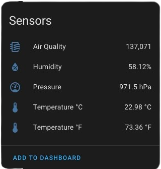
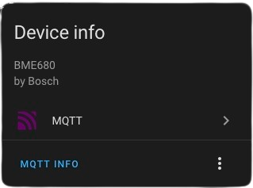

# bme680-mqtt

A docker image which reads data from a Bosch BME680 atmospherics sensor, and sends the result to HomeAssistant via a MQTT broker.

|  |  |
| :------------------------------------------------------------------: | :------------------------------------------------------------------: |
|          An example taken from the HomeAssistant dashboard.          |              The device in HomeAssistant's device view.              |

## Example Compose File:

This example compose specification can be used to run the docker container:

> [!IMPORTANT]
> This repository and its associated docker image are currently private. Make sure to sign in with `docker login` before attempting to pull the image.

```YAML
services:
  bme680-mqtt:
      image: ghcr.io/lillian-alicia/bme680-mqtt:1.0 # Select image version here

      volumes:
        - /dev/i2c-1:/dev/i2c-1 # Pass through the i2c device from the host.

      environment:
        MQTT_ADDR: 'example.broker.com'
        MQTT_PORT: 1883 # Port for the MQTT broker, defaults to 1883.
        MQTT_AUTH_MODE: 'none' # Replace with 'env' or 'file' if desired - see docs.
        POLL_TIME: 60 # How often to send data via MQTT, in seconds.

        MQTT_USERNAME: 'username' # The username and password for the MQTT
        MQTT_PASSWORD: 'password' # broker if using MQTT_AUTH_MODE 'env'.

      privileged: true
```

## MQTT Broker

An external MQTT broker is required in order for this container to send data to home assistant. This can be run locally as a container, on another host, or within homeassistant. I recommend using the [Eclipse Mosquitto](https://hub.docker.com/_/eclipse-mosquitto) broker, which can be run as a docker container.

The broker must support retained messages, and Quality of Service level 2 (QOS).

### Authentication

This image supports both unauthenticated and authenticated connections to an MQTT broker, through the `MQTT_AUTH_MODE` environment variable (see [Environment Variables](README.md#environment-variables)).

The authentication mode can be set to one of three options:

- `none` - No authentication. Any provided credentials will be ignored.
- `env` - Authentication credentials are supplied through environment variables (`MQTT_USERNAME` and `MQTT_PASSWORD`).
- `file` - Authentication credentials are supplied in JSON format, in a file bind-mounted to the container.

If using the `file` auth mode, the credentials should be supplied in the following format:

```json
{ "username": "USERNAME_HERE", "password": "YOUR_PASSWORD" }
```

## HomeAssistant Discovery via MQTT

HomeAssistant includes a discovery feature (see the [documentation](https://www.home-assistant.io/integrations/mqtt#mqtt-discovery) for more information), which subscribes to a specific MQTT topic. Devices transmitting via MQTT can send a discovery message to this topic, which HomeAssisant uses to automatically setup devices.

This docker image sends the following discovery message, which adds all of the data read from the BME680 sensor. Some parts of the message are set by [environment variables](README.md#environment-variables) - see below.

**Coming Soon - Configuration to enable and disable selcted data.**

```JSON
{
        "device"        :       {
            "name"      :       "[DEVICE_ID]",
            "mf"        :       "Bosch",
            "mdl"       :       "BME680",
            "ids"       :       "BME680_[DEVICE_ID]"
        },
        "origin"        :       {
            "name"      :       "bme680-mqtt",
            "url"       :       "https://github.com/lillian-alicia/bme680-mqtt",
            "sw"        :       "[Image Version Number]"
        },
        "components"    :       {
            "temperature_celcius":      {
                "name"          :   "Temperature °C",
                "platform"      :   "sensor",
                "device_class"  :   "temperature",
                "unit_of_measurement" : "°C",
                "suggested_display_precision" : 2,
                "value_template":   "{{ value_json.temperature.celcius }}",
                "unique_id"     :   "[DEVICE_ID]_temperature_celcius"
            },
            "temperature_farenheit":      {
                "name"          :   "Temperature °F",
                "platform"      :   "sensor",
                "device_class"  :   "temperature",
                "unit_of_measurement" : "°F",
                "suggested_display_precision" : 2,
                "value_template":   "{{ value_json.temperature.fahrenheit }}",
                "unique_id"     :   "[DEVICE_ID]_temperature_fahrenheit"
            },
            "pressure"          :      {
                "name"          :   "Pressure",
                "platform"      :   "sensor",
                "device_class"  :   "pressure",
                "unit_of_measurement" : "hPa",
                "suggested_display_precision" : 1,
                "value_template":   "{{ value_json.pressure.pressure }}",
                "unique_id"     :   "[DEVICE_ID]_pressure"
            },
            "humidity"          :      {
                "name"          :   "Humidity",
                "platform"      :   "sensor",
                "device_class"  :   "humidity",
                "unit_of_measurement" : "%",
                "suggested_display_precision" : 2,
                "value_template":   "{{ value_json.humidity.humidity }}",
                "unique_id"     :   "[DEVICE_ID]_humidity"
            },
            "air_quality"       :       {
                "name"          :   "Air Quality",
                "platform"      :   "sensor",
                "device_class"  :   "aqi",
                "unit_of_measurement" : "none",
                "suggested_display_precision" : 0,
                "value_template":   "{{ value_json.airQuality.resistance }}",
                "unique_id"     :   "[DEVICE_ID]_air_quality"
            }},
        "state_topic"   :       "[MQTT_TOPIC]"
    }
```

## Environment Variables

This docker image is designed to have user-friendly customisation. All of the necessary options are set using environment variables, and default to sane values.

### Sensor Config

- `I2C_ADDR` - The i2c address of the BME680 sensor. **Defaults to 0x76**, the standard address for i2C devices.
- `POLL_TIME` - How frequently to send sensor data to HomeAssistant, in seconds. **Defaults to 60s**.

### MQTT Broker Config

- `MQTT_ADDR` - (**REQUIRED**) The IP address or hostname for the MQTT broker (see [MQTT Broker](README.md#mqtt-broker) for more information.)
- `MQTT_PORT` - The port that the MQTT broker communicates on. **Defaults to 1883**, the default port used for MQTT.
- `MQTT_AUTH_MODE` - The authentication method used to connect to the MQTT broker. This can be `none`, `env`, or `file` (see [Authentication](README.md#authentication)).
- `MQTT_USERNAME` **(OPTIONAL)**

### MQTT Topics Config

- `MQTT_TOPIC` - The topic that MQTT messages containing sensor data are sent on. **Defaults to `bme680`**. This topic is automatically passed on to HomeAssistant when using discovery (see [Discovery](README.md#homeassistant-discovery-via-mqtt)).
- `DISCOVERY_TOPIC` - The topic used by HomeAssistant for discovery. The default topic used in a HomeAssistant installation is `homeassistant`, however it can be changed by the user.
- `DEVICE_ID` - The device name given to HomeAssistant via discovery. Note that the **device name** in HomeAssistant will be this ID, and the **device ID** will be `BME680_{DEVICE_ID}`.

## Advanced Usage

### Multiple Sensors

This project can be used to connect multiple BME680 sensors to HomeAssistant, provided that each instance of this container has a unique `DEVICE_ID` set as an [environment variable](README.md#environment-variables).

### Disabling Discovery

**Coming Soon...**
Disabling use with HomeAssistant's discovery feature will soon be available by passing an environment variable to this container.
